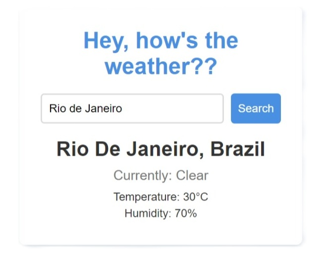

# Hey, how's the weather?

*"Never let the rain catch you off guard ever again!"*

A super simple weather web app, solely for learning purposes!
This isn't meant to be taken seriously, it is just for fun and sake of writing code!

### Working demo and screenshot

- [Weather App](https://burunokun.github.io/weather_app)

### Powered by...

- [wttr.in](https://github.com/chubin/wttr.in) <- check it out!

